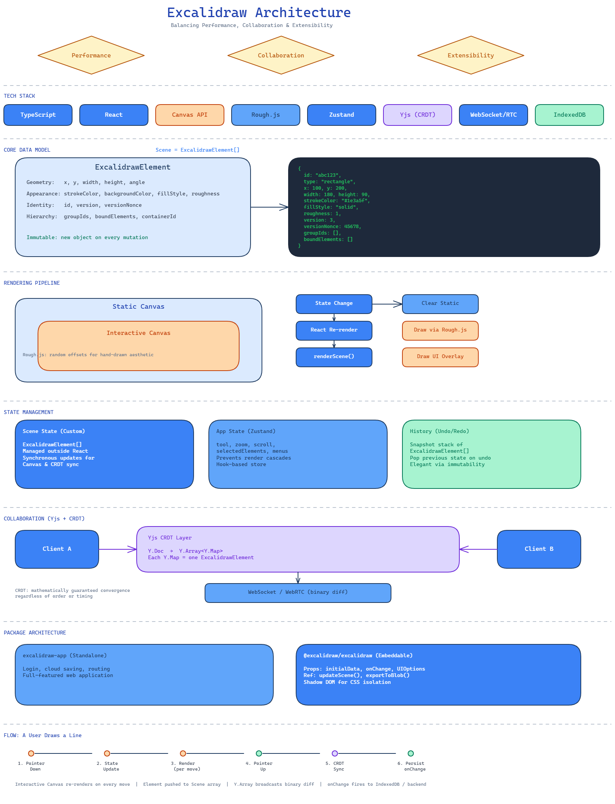

```
███████╗██╗  ██╗ ██████╗ █████╗ ██╗     ██╗██████╗ ██████╗  █████╗ ██╗    ██╗
██╔════╝╚██╗██╔╝██╔════╝██╔══██╗██║     ██║██╔══██╗██╔══██╗██╔══██╗██║    ██║
█████╗   ╚███╔╝ ██║     ███████║██║     ██║██║  ██║██████╔╝███████║██║ █╗ ██║
██╔══╝   ██╔██╗ ██║     ██╔══██║██║     ██║██║  ██║██╔══██╗██╔══██║██║███╗██║
███████╗██╔╝ ██╗╚██████╗██║  ██║███████╗██║██████╔╝██║  ██║██║  ██║╚███╔███╔╝
╚══════╝╚═╝  ╚═╝ ╚═════╝╚═╝  ╚═╝╚══════╝╚═╝╚═════╝ ╚═╝  ╚═╝╚═╝  ╚═╝ ╚══╝╚══╝

██████╗ ██╗ █████╗  ██████╗ ██████╗  █████╗ ███╗   ███╗
██╔══██╗██║██╔══██╗██╔════╝ ██╔══██╗██╔══██╗████╗ ████║
██║  ██║██║███████║██║  ███╗██████╔╝███████║██╔████╔██║
██║  ██║██║██╔══██║██║   ██║██╔══██╗██╔══██║██║╚██╔╝██║
██████╔╝██║██║  ██║╚██████╔╝██║  ██║██║  ██║██║ ╚═╝ ██║
╚═════╝ ╚═╝╚═╝  ╚═╝ ╚═════╝ ╚═╝  ╚═╝╚═╝  ╚═╝╚═╝     ╚═╝
```

Agent skill for creating `.excalidraw` JSON diagrams that make visual arguments for workflows, architectures, systems, protocols, and concepts.

## Table of Contents

- [Sample Output](#sample-output)
- [Install With npm](#install-with-npm)
- [Supported Assistants](#supported-assistants)
- [Aliases](#aliases)
- [Usage](#usage)
- [Viewing Generated Diagrams](#viewing-generated-diagrams)
- [Renderer Setup](#renderer-setup)
- [Repository Layout](#repository-layout)
- [License](#license)
- [Author](#author)

## Sample Output



_Architecture diagram generated by the skill — rendered from_ [`excalidraw-architecture.excalidraw`](excalidraw-architecture.excalidraw)

The skill includes:

- Excalidraw diagram design methodology
- Semantic color palette
- JSON element templates
- Excalidraw schema notes
- Playwright-based renderer for PNG previews

## Install With npm

```bash
npm install -g excalidraw-skill
excalidraw-skill install --ai codex
```

Or run it without a global install:

```bash
npx excalidraw-skill install
```

By default this installs for Codex in the current project:

```text
.codex/skills/excalidraw-diagram
```

Install for Claude Code:

```bash
excalidraw-skill install --ai claude
```

This installs to:

```text
.claude/skills/excalidraw-diagram
```

Install for Gemini CLI:

```bash
excalidraw-skill install --ai gemini
```

This installs to:

```text
.gemini/skills/excalidraw-diagram
```

Install for all supported assistants:

```bash
excalidraw-skill install --ai all
```

Global install:

```bash
excalidraw-skill install --ai codex --global
excalidraw-skill install --ai claude --global
excalidraw-skill install --ai gemini --global
```

Custom skills directory:

```bash
excalidraw-skill install --target ~/.codex/skills --force
```

## Supported Assistants

| Assistant       | `--ai` value    | Project install path                    | Global install path                     |
| --------------- | --------------- | --------------------------------------- | --------------------------------------- |
| Claude Code     | `claude`        | `.claude/skills/excalidraw-diagram`     | `~/.claude/skills/excalidraw-diagram`   |
| Cursor          | `cursor`        | `.cursor/skills/excalidraw-diagram`     | `~/.cursor/skills/excalidraw-diagram`   |
| Windsurf        | `windsurf`      | `.windsurf/skills/excalidraw-diagram`   | `~/.windsurf/skills/excalidraw-diagram` |
| Antigravity     | `antigravity`   | `.agents/skills/excalidraw-diagram`     | `~/.agents/skills/excalidraw-diagram`   |
| GitHub Copilot  | `copilot`       | `.github/prompts/excalidraw-diagram`    | `~/.github/skills/excalidraw-diagram`   |
| Kiro            | `kiro`          | `.kiro/steering/excalidraw-diagram`     | `~/.kiro/skills/excalidraw-diagram`     |
| Codex           | `codex`         | `.codex/skills/excalidraw-diagram`      | `~/.codex/skills/excalidraw-diagram`    |
| Roo Code        | `roocode`       | `.roo/skills/excalidraw-diagram`        | `~/.roo/skills/excalidraw-diagram`      |
| Qoder           | `qoder`         | `.qoder/skills/excalidraw-diagram`      | `~/.qoder/skills/excalidraw-diagram`    |
| Gemini CLI      | `gemini`        | `.gemini/skills/excalidraw-diagram`     | `~/.gemini/skills/excalidraw-diagram`   |
| Trae            | `trae`          | `.trae/skills/excalidraw-diagram`       | `~/.trae/skills/excalidraw-diagram`     |
| OpenCode        | `opencode`      | `.opencode/skills/excalidraw-diagram`   | `~/.opencode/skills/excalidraw-diagram` |
| Continue        | `continue`      | `.continue/skills/excalidraw-diagram`   | `~/.continue/skills/excalidraw-diagram` |
| CodeBuddy       | `codebuddy`     | `.codebuddy/skills/excalidraw-diagram`  | `~/.codebuddy/skills/excalidraw-diagram`|
| Droid (Factory) | `droid`         | `.factory/skills/excalidraw-diagram`    | `~/.factory/skills/excalidraw-diagram`  |
| KiloCode        | `kilocode`      | `.kilocode/skills/excalidraw-diagram`   | `~/.kilocode/skills/excalidraw-diagram` |
| Warp            | `warp`          | `.warp/skills/excalidraw-diagram`       | `~/.warp/skills/excalidraw-diagram`     |
| Augment         | `augment`       | `.augment/skills/excalidraw-diagram`    | `~/.augment/skills/excalidraw-diagram`  |

### Aliases

Common typos and alternate names are accepted:

| Alias            | Resolves to |
| ---------------- | ----------- |
| `openai`         | `codex`     |
| `gemni`, `gemimi`| `gemini`    |
| `roo`, `roo-code`| `roocode`   |
| `github-copilot` | `copilot`   |
| `kilo-code`      | `kilocode`  |
| `code-buddy`     | `codebuddy` |

## Usage

After installation, ask your assistant for an Excalidraw diagram:

```text
Use $excalidraw-diagram to create an Excalidraw architecture diagram for my data pipeline.
```

The skill guides the assistant to plan the visual argument, create `.excalidraw` JSON, render a PNG preview, inspect it, and iterate.

## Viewing Generated Diagrams

AI assistants generate `.excalidraw` JSON files. You can view them in any of these ways:

- Render a PNG preview with the bundled renderer. See [Renderer Setup](#renderer-setup), then run the renderer against your `.excalidraw` file.
- Open the `.excalidraw` file in VS Code with an Excalidraw extension installed.
- Import the file into [Excalidraw](https://excalidraw.com/) by opening the site and dragging the `.excalidraw` file onto the canvas, or using the menu to open a local file.

## Renderer Setup

The skill can render `.excalidraw` files to PNG using Playwright and Chromium:

```bash
python -m pip install -r .codex/skills/excalidraw-diagram/scripts/requirements.txt
python -m playwright install chromium
```

Then render:

```bash
python .codex/skills/excalidraw-diagram/scripts/render_excalidraw.py path/to/diagram.excalidraw
```

The renderer imports Excalidraw's browser bundle, so first-time rendering may require network access.

## Repository Layout

```text
skills/excalidraw-diagram/      # Bundled SKILL.md skill
  agents/                        # Agent-specific YAML configs (one per assistant)
  references/                    # Color palette, element templates, JSON schema
  scripts/                       # Python renderer (Playwright + Chromium)
bin/excalidraw-skill.js          # npm installer CLI
skill.json                       # Skill metadata
package.json                     # npm package metadata
```

## License

MIT

## Author

Dave Nguyen
